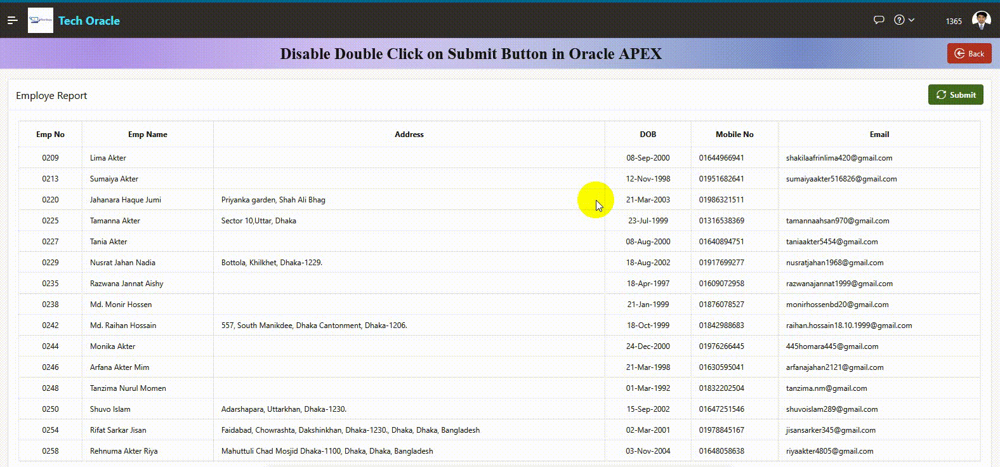

# Prevent Double Click & Duplicate Submission

**👉 Prevent duplicate form submission by blocking double-click events and disabling repeated user actions during processing.**

This feature prevents users from accidentally submitting the same request multiple times by:

- Disabling the button after the first click
- Blocking rapid double-click events
- Locking the UI during processing
- Preventing duplicate server requests
  
It improves application stability and avoids duplicate records in the database.

---

**✨ Features**
```✅ Prevents double-click submissions
✅ Blocks duplicate requests during processing
✅ Button locking with visual feedback
✅ Auto-reset after timeout
✅ Works with Oracle APEX and plain JS
✅ No dependencies
```
---
## 🎬 Demo


---
## 💡 Work Process
- **Step # 01 : Create a Button**
- Button Name : SUBMIT
- Button Static ID : submitBtn

- **Step # 02 : Create a Dynamic Actions of SUBMIT button**
- Event : Click
- Selection Type : Button
- Button : SUBMIT
  
- **True Action :** Execute JavaScript Code
- Code :

```
var btn = document.getElementById("submitBtn");
    if (btn.dataset.locked === "Y") {
        apex.message.alert("Already submitted. Please wait...");
        return false;
}
    if (!btn.dataset.originalText) {
         btn.dataset.originalText = btn.innerHTML;
}
    btn.dataset.locked = "Y";
    btn.disabled = true;
    btn.innerHTML = '<span class="fa fa-refresh fa-anim-spin-step"></span> Processing...';

    setTimeout(() => {
    btn.innerHTML = '<span class="fa fa-check-circle-o fa-anim-flash"></span> Completing.';

        setTimeout(() => {
        btn.dataset.locked = "N";
            btn.disabled = false;
            btn.innerHTML = btn.dataset.originalText;
    }, 2500);
}, 2000);
```
